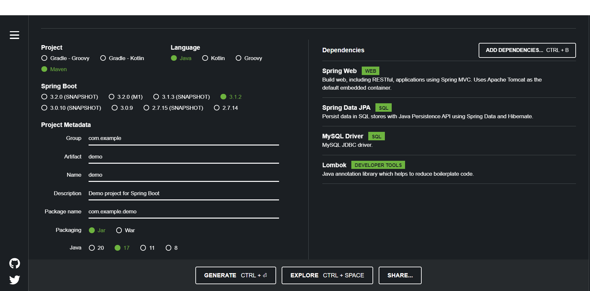
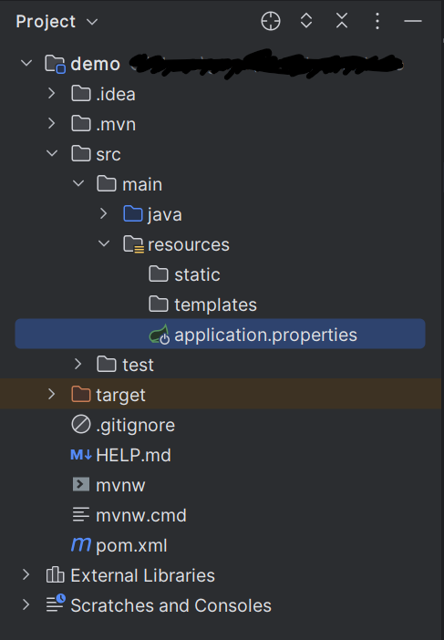

# Step By Step Guide

## 1. Spring Initializer:

- Go to the <a href="https://start.spring.io/" target="_blank">Spring Initializer website</a>.(right-click and choose "Open link in new tab" or use middle-click).
  
- When creating a Spring Boot application, ensure to include the following dependencies for building web applications ("Spring Web"), database connectivity using JPA ("Spring Data JPA"), enabling MySQL database communication ("MySQL Driver"), and code simplification with Lombok.



- Click "Generate" to download the project as a ZIP file.

## 2. Import Project to IDE:

- Unzip the downloaded ZIP file.
  
- Import the project into your favorite IDE (Eclipse, IntelliJ, etc.) as a Maven or Gradle project.

## 3. Configure MySQL Connection:

- Open the `application.properties` file (located in `src/main/resources`).

<p align="center">

</p>
- Add the following lines to configure the MySQL connection:

```properties
spring.datasource.url=jdbc:mysql://localhost:3306/your-mysql-database
spring.datasource.username=your-mysql-username
spring.datasource.password=your-mysql-password
spring.jpa.hibernate.ddl-auto=update
```
Don't forget to replace `your-mysql-database`, `your-mysql-username`, and `your-mysql-password` with your actual MySQL database name, username, and password, respectively.

## 4. Create a New Entity Class:

- Create a new Java class in the appropriate package (e.g., `com.example.demo`) for your entity.
- Annotate the class with `@Entity` and provide a table name using `@Table` annotation.
- Define the class fields and annotate them as needed. For example:

```java
package com.example.demo;

import jakarta.persistence.*;
import lombok.Data;

@Entity
@Data
@Table(name = "STUDENTS")
public class Student {

    @Id
    @Column(name = "ID")
    private int id;

    @Column(name = "MARK")
    private double mark;

    @Column(name = "NAME")
    private String name;

}

```


### Explanation of the `Student` Entity

The `Student` class in the `com.example.demo` package is a JPA entity that represents the `STUDENTS` table in the MySQL database.

- `@Entity`: This annotation marks the `Student` class as a JPA entity, indicating that instances of this class should be mapped to rows in the corresponding database table.

- `@Data`: This annotation is provided by Lombok and automatically generates getter and setter methods for all fields in the class. It also generates the `toString`, `equals`, and `hashCode` methods, making the code concise and readable.

- `@Table(name = "STUDENTS")`: This annotation specifies the name of the database table to which the `Student` class is mapped. In this case, it's mapped to the `STUDENTS` table.

- `@Id`: This annotation marks the `id` field as the primary key of the `Student` entity.

- `@Column(name = "ID")`: This annotation specifies the name of the column in the database table that corresponds to the `id` field.

- `@Column(name = "MARK")`: This annotation specifies the name of the column in the database table that corresponds to the `mark` field.

- `@Column(name = "NAME")`: This annotation specifies the name of the column in the database table that corresponds to the `name` field.

## 5. Create a New Database in MySQL Workbench:

- Open MySQL Workbench and connect to your MySQL server.
  
- Create a new schema (database) with the same name as the one specified in `application.properties` (e.g., `your-mysql-database`).

## 6. Run the Application:

- Run the Spring Boot application. This will automatically create the necessary `students` table in your MySQL database based on the `Student` entity.
  
- Verify that the table is created in MySQL Workbench.

## 7. 💡Explore the Code:

With the setup complete, explore the codebase to understand how the `Student` entity is mapped to the database and how to perform CRUD operations using JPA.

